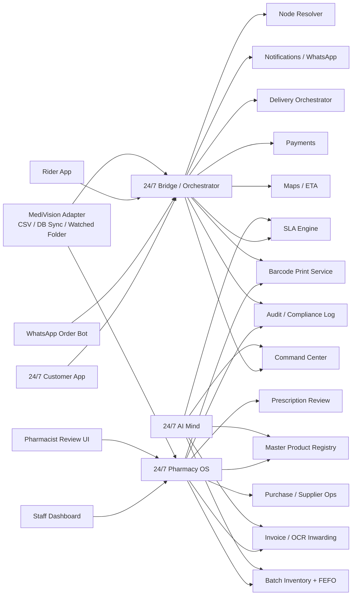
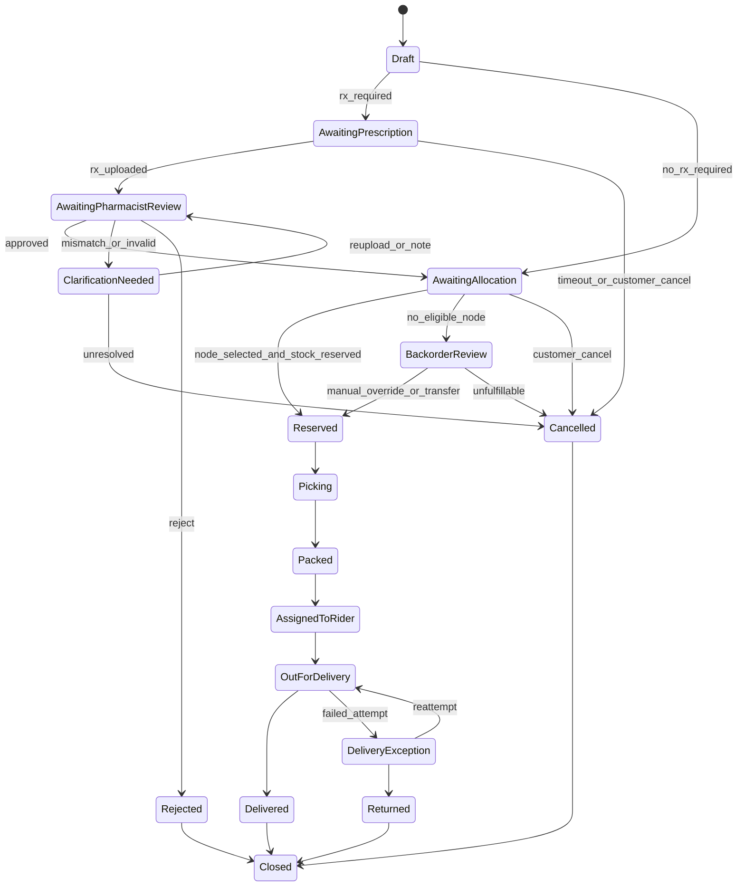

# 24/7 Pharmacy OS, App and Bridge for India

## Executive summary

24/7 should not be built as “another pharmacy app.” It should be built as a three-layer operating system for dense residential medication continuity: a native **24/7 Pharmacy OS** for store operations, a **24/7 customer app** for residents, and a **24/7 bridge/orchestrator** that owns order truth, routing, SLA control, WhatsApp, rider movement, sync, and eventing across all channels. That architecture matches the business thesis in your uploaded documents: in-building licensed pharmacies, micro-radius fulfilment, SLA-governed service, closed-loop therapy continuity, and compliance-grade auditability in high-density residential clusters. fileciteturn0file1 fileciteturn0file2

The competitive review supports building your own stack rather than living permanently inside Medivision. Samarth’s public material shows a solid local ERP-style base for billing, inventory, GST, expiry, and barcode handling; Medivision’s official material shows strong retail/wholesale batch, reporting, H1 alerting, barcode, scanned-prescription storage, and retailer-wholesaler “data exchange”; Marg’s official material is strongest on purchase import ergonomics, including Excel/CSV/PDF and bill-photo import plus WhatsApp workflows; eVitalRx’s public material is the most advanced among the reviewed pharmacy products on cloud CRM, refill reminders, patient app flows, and delivery tracking via VitRun. But none of the reviewed public materials centres your specific model: **building-bound node allocation, hard pharmacist gates, a command-center SLA engine, FEFO-first batch orchestration, inwarding from scanned bills into a master product registry, and a closed-loop refill/continuity engine as the primary architecture**. citeturn20search0turn19search0turn19search1turn18search2turn18search3turn18search6turn16search0turn16search1turn16search4

The legal boundary is equally clear and should shape the product from day one. Under India’s retail-pharmacy framework, dispensing on prescription is reserved to registered pharmacists, the prescription may not be substituted by the pharmacist, Schedule H/H1/X flows have additional controls, and H1 sales require specific records to be preserved for three years. At the same time, current NMC rules recognise a duly signed scanned or digital prescription delivered through email or a messaging platform, which makes app and WhatsApp prescription ingestion workable if the dispensing decision still sits with a pharmacist. citeturn31search3turn32search0turn32search5turn15search1turn30search1turn29search0turn23search0turn23search1

That means the right product strategy is **AI for operational intelligence, never AI for medicine selection or autonomous prescription fulfilment**. OCR, normalisation, forecasting, expiry-risk scoring, routing suggestions, and anomaly detection are safe and valuable. Automatic medicine selection, substitution, dose interpretation, prescription approval, or treatment advice are not. This also aligns with your chat-derived brief, which explicitly fixed AI boundaries, pincode/building routing, rider tracking, WhatsApp ordering, bill ingestion, barcode generation, and the 90-day/60-day expiry rules as non-negotiables. fileciteturn0file0 citeturn31search3turn32search0turn32search5turn8search1

No specific constraint has been supplied for stack, team size, or budget. This dossier therefore assumes greenfield technical freedom, but with a conservative Indian regulatory posture, a Mumbai-first density rollout, and a phased replacement of Medivision rather than a big-bang cutover. fileciteturn0file1

## Strategic fit and competitive baseline

Your uploaded business thesis is unusually specific and that is good: the moat is not “pharmacy software,” it is **residential medication infrastructure**. The documents frame the opportunity as a controlled 1–2 km radius, in-building or tightly embedded store presence, guaranteed fulfilment, repeat chronic demand, adherence continuity, and measurable SLA control. That means the system has to optimise for deterministic local execution, not marketplace breadth or pooled logistics. fileciteturn0file1

The reviewed Indian products validate different slices of the market, but not the full 24/7 model. Samarth validates that local Indian operators still buy practical ERP for billing/inventory/expiry basics. Medivision validates the importance of batch handling, H1 awareness, reports, barcodes, and retailer-wholesaler data exchange. Marg validates the exact pain you raised around line-by-line SKU creation by pushing PDF/CSV/photo-based inward import. eVitalRx validates cloud, CRM, refill, and rider-operation demand. The product decision for 24/7 is therefore not to reinvent basic pharmacy software from scratch conceptually; it is to **compose the strongest proven features into a denser, legally safer, SLA-native system whose centre of gravity is orchestration rather than accounting screens**. citeturn20search0turn19search0turn19search1turn18search1turn18search2turn18search3turn18search6turn16search0turn16search1turn16search4

### Competitive feature matrix

| Product | Batch / expiry | Purchase import automation | Barcode handling | CRM / WhatsApp | Delivery / rider ops | Patient / resident ordering | Main gap versus 24/7 model | Evidence |
|---|---|---|---|---|---|---|---|---|
| Samarth | Public material shows inventory, stock tracking and expiry management | Not evident in reviewed public material | Public material shows barcode-based stock handling | Not evident in reviewed public material | Not evident in reviewed public material | Not evident in reviewed public material | Good local ERP core, but publicly documented scope is much narrower than a dense-node orchestrator | citeturn20search0 |
| Medivision | Public material shows expiry handling, non-moving/slow-moving, H1/narcotic alerts | Public material shows retailer-wholesaler data exchange and automatic purchase feeding, but not bill-photo inward OCR on the reviewed retail pages | Public material shows barcode scanning and barcode generation | Public material shows Bulk SMS and order/data exchange | Advanced delivery tracking is visible in wholesale material; rider ops are not a clear retail-centre theme in reviewed public material | “Mobile applications” are shown for retailers/wholesalers, not a resident-first closed-loop consumer app | Strong for legacy pharmacy operations; weak as a resident-facing SLA and continuity platform | citeturn19search0turn19search1turn19search2turn19search3 |
| Marg | Public material strongly shows Excel/CSV/PDF import and bill-photo import | Strongest among reviewed products on inward-entry automation | Public material shows e-store and billing ecosystem expectations; barcode support is part of broader ERP/public pages | Public material shows WhatsApp invoices/reminders and prescription reminders | Not a rider-command-center product in reviewed public material | Public material shows e-store / customer-ordering patterns, but not building-aware node orchestration | Best benchmark for bill-import ergonomics, but not for dense-SLA control | citeturn18search1turn18search2turn18search3turn18search5turn18search6turn18search8turn0search8 |
| eVitalRx | Public material shows real-time inventory, expiry, reorder and warehouse/multi-store handling | Public material shows data porting and CSV-based speed, though not reviewed as bill-photo-first as Marg | Public material shows product catalogue and barcodes | Strong CRM: WhatsApp, refill reminders, offers, loyalty, invoices | Strongest among reviewed products on delivery tracking and route optimisation via VitRun | Public material explicitly includes patient ordering app | Closest current benchmark to your app + ops direction, but still not positioned around building-bound orchestration, conservative compliance gates, or Medivision replacement sequencing | citeturn16search0turn16search1turn16search3turn16search4 |

A useful market signal beyond the requested four is SWIL: its public material also emphasises expiry, restricted-drug management, mobile-app integration, barcode, and near-expiry reporting. That reinforces the conclusion that Indian pharmacy software is steadily moving outward from billing into operations, but still usually from the store outward, not from the neighbourhood inward. 24/7 should take the latter path. citeturn17search0turn17search5turn17search6

## Legal and AI governance

Under the Indian retail-pharmacy stack, the first non-negotiable is human control of dispensing. The entity["organization","Pharmacy Council of India","india"] reiterates that, under section 42 of the Pharmacy Act, no person other than a registered pharmacist may compound, prepare, mix or dispense medicines on prescription. The Pharmacy Practice Regulations also state that every registered pharmacist shall dispense only those medicines as prescribed by the registered medical practitioner and shall not substitute the prescription. This single principle should shape the software architecture more than any feature wish-list. citeturn31search3turn31search0turn32search0turn32search5

The second non-negotiable is prescription control. The Drugs Rules require that prescriptions containing Schedule H, Schedule H1 and Schedule X items are not to be dispensed more than once unless the prescriber says so. For H1 drugs, supply must be recorded with the prescriber’s name and address, the patient’s name, the drug name, and quantity supplied, and those records must be maintained for three years. H1 labels also carry the warning that they are not to be sold by retail without the prescription of a registered medical practitioner. citeturn15search1turn30search1turn14search14turn13search1

The third non-negotiable is how digital prescriptions are handled. The entity["organization","National Medical Commission","india"] 2023 professional-conduct regulations state that RMPs shall provide a clear photograph, scanned or digital copy of a duly signed prescription to the patient via email or a messaging platform. Telemedicine guidance remains list-based and keeps prohibited medicines and Schedule X / narcotic / psychotropic substances outside normal tele-prescribing flows. That means digital ingestion is operationally valid, but the platform must still treat every prescription as a regulated artefact requiring pharmacist review, schedule-aware controls, and auditable fulfilment. citeturn29search0turn23search0turn23search1

The fourth non-negotiable is expiry and disposal discipline. The entity["organization","Central Drugs Standard Control Organisation","india regulator"] guidance on expired/unused drugs refers back to separate storage under Rule 65(17), and WHO good storage/distribution guidance reinforces FEFO-style stock discipline and visible batch/expiry handling. Your proposed 90-day warning threshold and 60-day hard-control threshold are therefore stricter than the floor and are strategically sound. citeturn8search0turn7search3turn7search4

### What the AI mind may do

The right AI policy is to let AI accelerate **data movement and operational decisions**, while denying it any autonomous **clinical or dispensing authority**. The table below is the recommended operating doctrine for 24/7, and it is the only way to keep the product aligned both with your own compliance stance and with the pharmacist-only dispensing framework. fileciteturn0file0 citeturn31search3turn32search0turn32search5

| AI function | Status | Why |
|---|---|---|
| OCR of purchase invoices and prescriptions | Allowed | Data capture only; human review remains available |
| Product normalisation, synonym dedupe, manufacturer/pack matching | Allowed | Operational data quality, not clinical choice |
| Batch-ageing score, FEFO recommendation, expiry-risk ranking | Allowed | Inventory governance |
| Demand forecasting, reorder suggestions, stockout risk | Allowed | Supply planning |
| Rider ETA prediction, route suggestion, non-movement alerts, SLA breach prediction | Allowed | Logistics optimisation |
| Dashboard summarisation, anomaly clustering, exception queues | Allowed | Ops analytics |
| Draft same-molecule reference list for pharmacist research | Assist-only | Must not become substitution engine |
| Automatic substitution of prescribed medicines | Prohibited | PCI regulation says pharmacist shall not substitute the prescription |
| Prescription approval / rejection by AI alone | Prohibited | Dispensing decision must stay with pharmacist |
| Choosing medicines, dose, regimen, or treatment advice | Prohibited | That would cross into clinical decision-making |
| Autonomous H/H1/X release or refill continuation | Prohibited | Regulated drug controls require human gate |
| Customer-facing “AI recommendation” of prescription medicines | Prohibited | High compliance risk and not aligned with your brief |

### Required audit logs

A 24/7-grade system should be built as if every regulated event may one day need to be shown to an inspector, auditor, or investor. The audit model should therefore be event-first, tamper-evident, and actor-attributed.

| Audit domain | Minimum log fields |
|---|---|
| Prescription ingestion | order_id, prescription_id, source_channel, upload_hash, received_at |
| Pharmacist review | pharmacist_id, review_action, approved_lines, rejected_lines, notes, timestamp |
| Schedule H/H1/X handling | schedule_flag, prescriber/patient fields, repeat-dispense check result, validation timestamp |
| AI suggestion trail | model_name, task_type, input_hash, output_json, confidence, human_accepted_by, human_accepted_at |
| Inventory mutation | node_id, batch_id, movement_type, quantity, before_qty, after_qty, actor_id, reason |
| Expiry / quarantine / disposal | batch_id, days_to_expiry, action, reviewer_id, photo/evidence_ref, disposal_ref |
| Node override | order_id, old_node, new_node, override_reason, actor_id, approval_path |
| Rider operations | rider_id, assignment, pickup confirm, live location heartbeat, proof-of-delivery, COD reconciliation |
| WhatsApp messages | wamid/template_id, inbound/outbound, order_id, customer_id, delivery status, payload hash |
| Sync / integration jobs | source, file/db ref, row counts, conflicts, success/failure, operator or service identity |

## Product blueprint

The uploads already describe the core shape: resident app, admin dashboard, inventory, payments, delivery tracking, refill reminders, then a later AI layer. The chat-derived brief then extends that into a much more specific operating model: Medivision replacement over time, scanned-bill inwarding, barcodes, FEFO, expiry buckets, WhatsApp bot, pincode/building routing, rider tracking, SLA dashboard, command center, and an AI mind bounded to lawful operational work. fileciteturn0file2 fileciteturn0file0

The recommended blueprint is below.

| Layer | Core modules | What it owns |
|---|---|---|
| 24/7 Pharmacy OS | Master Product Registry, Batch Inventory, Purchase & Inwarding, Barcode Service, Pharmacist Review, Order Workspace, Transfers, Returns, Disposal, GST/Tally export, Staff/Roles | Store truth and regulated operational workflows |
| 24/7 Customer App | OTP auth, catalogue, Rx upload, building/flat profile, order placement, live order status, payments, refill reminders, invoices, trust centre | Resident experience and repeat ordering |
| 24/7 Bridge / Orchestrator | Order state machine, node resolution, SLA engine, WhatsApp bot, notifications, rider assignment, sync adapters, event bus, command center | Cross-channel order truth and control |
| 24/7 AI Mind | OCR, parsing, matching, forecasting, expiry scoring, route suggestions, anomaly detection, summary intelligence | Operational intelligence only |
| 24/7 Command Center | SLA board, expiry exposure, refill pipeline, sync health, manual overrides, incident queues | Real-time network supervision |

### System architecture

The diagram below turns your business thesis into a production topology: app and WhatsApp flow into a single orchestrator; the orchestrator resolves node, SLA and state; Medivision is bridged during migration; and the native OS becomes the long-term operational core. fileciteturn0file1 fileciteturn0file2 fileciteturn0file0

### The modules that matter most

The **master product registry** is the heart of the whole replacement strategy. It must sit above Medivision, Marg-style imports, app search, and store billing. It should canonicalise product names, generics, strength, form, manufacturer, pack, schedule flags, prescription requirement, HSN/GST, and barcode references, while still preserving the raw strings from legacy systems and invoices. Without this layer, you will keep inheriting the mess of supplier naming forever. Your current Medivision export is already enough to seed the first version because it provides product names, units, companies, quantities and values, while some prescription flags are embedded in names. fileciteturn0file0

The **inwarding engine** should solve the exact pain you identified: no more one-by-one SKU creation as the normal path. Instead, purchase bills should enter as photo/PDF/CSV/data-exchange feeds, produce a draft inward, match against the registry, create unknown-item review tasks where necessary, and then generate internal batch barcodes for the items that need them. The fact that Marg now publicly markets PDF and bill-photo import is a strong signal that this pain is real and commercially important. citeturn18search1turn18search3turn18search6turn18search20

The **node resolver** must be designed for your density thesis, not generic e-commerce logistics. The right routing logic is: **building mapping first, pincode fallback second, operational score last**. If a society or tower is explicitly bound to a node, that node should be primary unless it is closed, licence-disabled, lacks pharmacist coverage, or fails other hard compliance gates. Only then should pincode or nearest-eligible logic apply. This is more faithful to your model than “nearest pincode wins.” fileciteturn0file1 fileciteturn0file0

The **bridge/orchestrator** is the irreversible differentiator. Existing Indian systems tend to be store-centric. 24/7 must be event-centric: one order ID, one state machine, one notification spine, one SLA clock, one rider ledger, one manual-override log, and one command center across all channels. This bridge is what will make Medivision redundant over time rather than merely “integrated.” fileciteturn0file0

## Data model, workflows and APIs

### Ingestion pipeline for bills, PDFs and CSVs

This is the most important workflow for reducing setup pain and keeping the catalogue clean.

| Stage | What happens | Hard rule |
|---|---|---|
| Capture | Supplier invoice enters via photo, PDF, CSV, watched folder, or legacy import | Every source gets a job ID and raw file hash |
| OCR / Parse | Header and line items are extracted | Low-confidence fields stay marked, never hidden |
| Normalise | Supplier names, item names, units, pack sizes, GST fields, dates are cleaned | Preserve raw strings alongside normalised fields |
| Match | Candidate products are ranked against the master registry | Use manufacturer, pack, dosage form, strength, barcode, and historical supplier mapping |
| Review | Only ambiguous or unknown lines go to reviewer queue | No silent auto-creation of high-risk products |
| Commit | Purchase invoice + batch rows + stock movements are created | Commit is atomic |
| Barcode | Internal batch labels are generated where manufacturer barcode is absent or unusable | Never mint fake GS1 codes for external commerce |
| Publish | Product availability becomes customer-visible only after commit | No customer-facing stock before inward success |
| Audit | Every step writes an audit event | Required |

Recommended confidence policy:
- **>= 0.95**: auto-draft and auto-match, then human spot-check queue.
- **0.70–0.95**: assisted review required before stock commit.
- **< 0.70**: forced manual resolution or new-product creation.

### Barcode strategy

Use manufacturer barcodes where they already exist. Where they do not, use internal identifiers without pretending they are global trade barcodes. entity["organization","GS1 India","india standards body"] says it is the only authorised seller of barcodes in India, that Indian GS1 barcodes begin with 890, and that such barcodes are needed for broader retail/e-commerce interoperability. 24/7 should therefore **reuse valid GTIN/EAN manufacturer codes**, but for internal store control it should use **Code 128** or QR labels for batch, shelf/bin, and order-packet operations. citeturn5search7turn5search16turn5search3

| Use case | Recommended code | Why |
|---|---|---|
| Manufacturer retail pack already has valid GTIN/EAN | Reuse existing barcode | Fastest, standard, no relabelling burden |
| Internal batch label | Code 128 | Compact, easy to print and scan, ideal for inward/pick/disposal |
| Shelf / bin / rack labels | Code 128 or QR | Internal navigation and reconciliation |
| Rider order packet / basket | QR + human-readable short code | Fast dispatch verification and proof-of-delivery linking |
| Customer invoice / payment ref | QR only where useful | Separate from inventory barcode domain |

### Expiry rules and FEFO policy

The platform should implement FEFO by default and make the expiry windows first-class objects, not passive reports. WHO guidance supports FEFO/FIFO stock discipline, and CDSCO guidance requires proper separate handling of expired/unused stock. Your requested thresholds should be productised exactly as operating rules. citeturn7search3turn7search4turn8search0

| Zone | Rule | System action |
|---|---|---|
| More than 90 days to expiry | Saleable | Standard FEFO picking |
| 90 to 61 days | Warning zone | Dashboard card, manager alert, auto-review for transfer/clearance |
| 60 to 31 days | Critical zone | Hard escalation, reduced reorder confidence, inter-store transfer and markdown plan review |
| 30 days or below | Quarantine candidate | Require explicit pharmacist/manager release policy by category |
| Expired | Hard block | Remove from sale, quarantine, disposal workflow only |

The **60-day hard limit** should not mean “always unsaleable regardless of category”; it should mean “cannot remain invisible or unmanaged.” For many fast-moving safe OTC items, commercial action may still be lawful before expiry. For prescription or slow-moving items, 60 days should usually trigger transfer, hold, or controlled clearance planning. The important thing is that nothing inside the 60-day bucket stays on ordinary autopilot. fileciteturn0file0

### Core data model

The following tables are the minimum useful schema for a 24/7-grade system.

| Table | Key fields |
|---|---|
| nodes | id, name, licence_no, licence_valid_to, status, type, lat, lng, service_radius_m, cut_offs_json, cold_chain_capable, controlled_drug_capable |
| buildings | id, name, address, pincode, lat, lng, default_node_id, fallback_node_ids_json, tower_map_json |
| customers | id, mobile, name, default_building_id, flat_no, alternate_addresses_json, consent_flags_json, created_at |
| customer_addresses | id, customer_id, label, address_lines, building_id, pincode, lat, lng, access_notes |
| pharmacists | id, employee_id, registration_no, node_id, shift_roster_json, status |
| suppliers | id, name, gstin, contact_json, preferred_import_mode |
| manufacturers | id, name, aliases_json |
| products | id, raw_name, display_name, generic_name, strength, dosage_form, pack_size, unit_text, manufacturer_id, hsn_code, gst_rate, schedule_flag, prescription_required, searchable_tokens, status |
| product_aliases | id, product_id, alias_text, source, confidence |
| product_barcodes | id, product_id, barcode_type, barcode_value, is_primary, source |
| batches | id, node_id, product_id, supplier_id, batch_no, mfg_date, expiry_date, mrp, purchase_rate, sale_rate, qty_on_hand, qty_reserved, qty_quarantined, storage_condition, internal_barcode |
| stock_movements | id, batch_id, node_id, movement_type, qty, ref_type, ref_id, actor_type, actor_id, created_at |
| purchase_invoices | id, supplier_id, node_id, invoice_no, invoice_date, source_type, raw_file_ref, status, total_value |
| purchase_lines | id, purchase_invoice_id, raw_line_text, product_id, batch_id, qty, rate, tax_json, confidence, reviewer_id |
| prescriptions | id, customer_id, order_id, source_channel, file_ref, extracted_json, review_status, pharmacist_id, review_notes, reviewed_at |
| orders | id, channel, customer_id, address_id, requested_node_id, allocated_node_id, fulfilled_node_id, order_status, requires_prescription, payment_status, promised_eta_at, placed_at |
| order_lines | id, order_id, product_id, requested_qty, approved_qty, fulfilled_qty, batch_id, mrp, sale_rate, line_status |
| refill_plans | id, customer_id, product_id, cadence_days, last_fill_at, next_due_at, status, snooze_until |
| riders | id, node_id, name, vehicle_type, status, shift_json |
| delivery_tasks | id, order_id, rider_id, assigned_at, picked_at, departed_at, delivered_at, cod_amount, pod_ref, current_status |
| rider_locations | id, rider_id, task_id, lat, lng, captured_at |
| wa_messages | id, customer_id, order_id, direction, template_name, wamid, status, payload_json, created_at |
| sla_events | id, order_id, event_type, event_at, target_at, breached, breach_reason |
| manual_overrides | id, entity_type, entity_id, previous_value_json, new_value_json, reason, actor_id, approved_by, created_at |
| ai_decisions | id, task_type, model_name, input_hash, output_json, confidence, accepted_by, accepted_at |
| audit_log | id, actor_type, actor_id, action, entity_type, entity_id, before_json, after_json, ip_addr, device_id, created_at |

### Current Medivision export field mapping

Your current project artefacts indicate that the Medivision export already gives enough to seed Phase 1 mapping even though it is not a full ideal master. fileciteturn0file0

| Current source field | Likely meaning | 24/7 target field | Notes |
|---|---|---|---|
| Product Name | Raw sellable item string | products.raw_name | Parse strength, dosage form, schedule flags from text |
| Unit | Pack / unit text | products.unit_text | Preserve raw unit wording |
| Company | Manufacturer / company | manufacturers.name | Normalise aliases later |
| Qty | Current stock count | batches.qty_on_hand or inventory_snapshot.qty | Needs node + batch context in future exports |
| Value | Stock value | inventory_snapshot.stock_value | Do not assume customer sale price |
| Embedded `[H]` / `[H1]` / `[NRX]` in name | Prescription flag hints | products.schedule_flag / prescription_required | Treat as imported clue until official master field exists |

### API surface

A practical v1/v1.5 API surface can stay small but must be coherent.

| Domain | Example endpoints |
|---|---|
| Auth | `POST /auth/otp/request`, `POST /auth/otp/verify`, `POST /auth/logout` |
| Profile | `GET /me`, `PATCH /me`, `PATCH /me/addresses/{id}`, `PATCH /me/consents` |
| Catalogue | `GET /catalog/search`, `GET /catalog/products/{id}`, `GET /catalog/availability?product_id=&address_id=` |
| Orders | `POST /orders`, `GET /orders/{id}`, `GET /orders`, `POST /orders/{id}/cancel`, `POST /orders/{id}/payment-link` |
| Prescription | `POST /orders/{id}/prescriptions`, `GET /prescriptions/{id}`, `POST /prescriptions/{id}/review`, `POST /prescriptions/{id}/request-reupload` |
| Refill | `GET /refills`, `POST /refills/{id}/draft-order`, `POST /refills/{id}/snooze` |
| Routing | `POST /routing/resolve-node`, `POST /routing/manual-override`, `GET /serviceability/buildings/{id}` |
| Inventory | `GET /inventory/batches`, `GET /inventory/products/{id}`, `POST /inventory/adjustments`, `POST /inventory/transfers` |
| Inwarding | `POST /ingestion/invoices`, `GET /ingestion/jobs/{id}`, `POST /ingestion/jobs/{id}/review`, `POST /ingestion/jobs/{id}/commit` |
| Barcode | `POST /barcodes/generate`, `POST /barcodes/print`, `GET /barcodes/{code}` |
| Delivery | `POST /deliveries/assign`, `POST /deliveries/{id}/pickup`, `POST /deliveries/{id}/location`, `POST /deliveries/{id}/deliver` |
| WhatsApp | `POST /integrations/whatsapp/webhook`, `POST /whatsapp/send-template`, `POST /whatsapp/handoff` |
| Medivision bridge | `POST /integrations/medivision/import-stock`, `POST /integrations/medivision/import-batches`, `POST /integrations/medivision/full-reconcile`, `GET /integrations/medivision/health` |
| Analytics | `GET /dashboards/sla`, `GET /dashboards/expiry`, `GET /dashboards/refills`, `GET /dashboards/sync-health` |

### Order state machine

The state machine should be explicit, not inferred from UI labels. This is what prevents compliance leakage, phantom stock promises, and rider confusion. The uploaded scope already defined resident-visible progression from placed to preparing to out-for-delivery to delivered; the 24/7 version needs to expand that into a regulated state machine. fileciteturn0file2 fileciteturn0file0

### Routing logic and SLA formulas

The node resolver should score only **eligible** nodes. Hard compliance blocks come first, then operational scoring. A production-safe scoring model is:

`score = (1000 × building_match) + (300 × pincode_match) + (150 × stock_coverage_pct) + (80 × sla_health_pct) – (10 × eta_minutes) – (2 × active_queue_load) – (1000 × compliance_block)`

The `compliance_block` should disqualify a node if:
- the store is shut or licence-disabled,
- a pharmacist is not on duty for a prescription order,
- the required batch is expired or quarantined,
- cold-chain or controlled-drug capability is absent,
- the sync freshness is below threshold for low-stock/high-risk fulfilment. fileciteturn0file0

Recommended SLA formulas:

- `promised_eta_at = prerequisites_cleared_at + queue_estimate + pick_pack_estimate + travel_estimate`
- `sla_remaining_seconds = promised_eta_at - now`
- `sla_hit_rate = delivered_within_promise / total_delivered_orders`
- `breach_risk_score = weighted(eta_slack, queue_load, rider_availability, prescription_pending, stock_fragility)`

Important design choice: **the customer-facing SLA clock should start only after prerequisites are satisfied**. For an Rx order, that means after valid prescription intake and pharmacist approval. Internally, however, you should still track total elapsed time from order creation for ops governance.

### WhatsApp order bot flows

Build the bot on the entity["company","Meta","whatsapp platform"] WhatsApp Cloud API. Meta’s official docs position Cloud API on Graph API with webhooks for inbound messages and status callbacks, and template messages for reminders, updates, shipping/payment-style notifications and similar event communication. That makes it the right production route for order intake, status messaging, refill reminders and human escalation. citeturn6search3turn6search2turn6search8turn6search15

| Flow | Customer action | System behaviour | Human gate |
|---|---|---|---|
| Search and order | “Need Dolo 650” or tap catalogue button | Search registry, show options, record draft order | Pharmacist gate if Rx required |
| Prescription order | Upload Rx image/PDF | Create order draft + prescription object + ack message | Mandatory pharmacist review |
| Reorder | “Repeat last month tablets” or tap reminder CTA | Pull last fulfilment, create draft with current availability | Pharmacist re-check for Rx products |
| Order status | “Where is my order?” | Return live state and ETA | None |
| Refill reminder | Outbound template with reorder CTA | Deep-link to app or WhatsApp draft order | Pharmacist review if Rx |
| Human handoff | “Talk to store” | Route to staff console with transcript attached | Staff/pharmacist |
| Delivery exception | Rider failed / gated building / unreachable | Auto message + reschedule options | Staff |

Every WhatsApp interaction should create or update the same order objects used by the app and dashboard. There must never be a shadow WhatsApp order book.

## Migration, testing and risks

### Phase roadmap

Your uploaded proposal correctly sequences the build as core platform first, then operational intelligence, then deeper clinical/predictive layers. For 24/7, that should be adapted into four practical phases that respect Medivision coexistence and your compliance guardrails. fileciteturn0file2 fileciteturn0file0

| Phase | What goes live | What remains outside scope |
|---|---|---|
| Phase 1 | Customer app, staff dashboard, order orchestration, WhatsApp status + order bot, basic rider tracking, Medivision stock sync, pharmacist review UI | Native accounting replacement, advanced AI, full inwarding replacement |
| Phase 1.5 | Master product registry, invoice/PDF/photo inwarding, internal barcode printing, batch ledger, expiry engine, command center, nightly reconciliation | Full native purchase/accounting close |
| Phase 2 | Native inventory truth, native purchase workflow, FEFO picking, inter-store transfer, routing/SLA engine, refill engine, store-to-store network ops | Full financial close/general ledger replacement if not needed yet |
| Phase 3 | Medivision retirement, native reporting/GST/Tally export maturity, advanced forecasting, continuity intelligence, later doctor/insurer integrations if still desired after legal review | Any autonomous clinical AI |

The most important strategic choice is this: **do not try to replace every accounting feature in v1**. Indian pharmacy operators expect GST and accounting outputs, but early replacement should focus on operational truth. In practice, 24/7 should first replace **catalogue, batches, order flow, prescription governance, routing, rider ops, inwarding and expiry control**, while exporting finance-friendly outputs into the accounting workflow your team prefers. This is also how market incumbents position themselves: pharmacy ERP buyers expect accounting compatibility, not necessarily a totally novel ledger from day one. citeturn19search0turn19search1turn16search4turn18search8

### Medivision migration design

Public Medivision materials show data exchange, MV Web Server, online ordering and rich reporting, but no public developer API documentation was evident in the reviewed materials. The safe conclusion is that **file export, watched-folder import, scheduled reports, or read-only DB sync are the realistic Phase 1 bridge patterns**, not a clean supported API-first integration. citeturn19search0turn19search1

| Stage | Source of truth | Integration mode | Recommended frequency |
|---|---|---|---|
| Early Phase 1 | Medivision for stock snapshots; Bridge for customer orders | CSV/PDF exports, watched folder, manual upload fallback | Stock delta every 5–15 min; nightly full reconciliation |
| Late Phase 1 | Medivision for legacy stock + OS for order/prescription/routing | Scheduled export + optional read-only DB pull if vendor permits | Stock every 5 min; catalog/price every 30–60 min |
| Phase 1.5 | OS for new inwarded inventory; Medivision still present for legacy/safety | Dual-run with batch reconciliation | Event-driven in OS; Medivision reconciliation nightly |
| Phase 2 | OS | Medivision read-only archive mode | Daily or on-demand audit sync only |
| Phase 3 | OS | Archive exports only | None operational |

Suggested sync safety rules:
- hard-block customer-facing “In Stock” if last stock sync is stale beyond threshold,
- force pick-time revalidation for low-stock items,
- maintain nightly full reconciliation,
- surface a **sync health card** in the command center.

### Recommended next Medivision export fields to request

The current artefacts are enough to start, but not enough to finish.

| Priority | Field / export | Why it matters |
|---|---|---|
| Critical | Item code / internal SKU | Stable identity beyond product-name parsing |
| Critical | Batch number | Mandatory for FEFO, recall and expiry control |
| Critical | Expiry date | Core batch governance |
| Critical | MRP | Sale logic and margin analysis |
| Critical | Sale rate / scheme-adjusted rate | Customer pricing and historical parity |
| Critical | Purchase rate | Margin, reorder and inward truth |
| Critical | GST rate and HSN code | Tax/reporting compatibility |
| Critical | Location / godown / store code | Multi-node inventory truth |
| High | Manufacturer/company code | Alias normalisation |
| High | Barcode / company barcode | Faster registry matching |
| High | Schedule flag as explicit field | Better than parsing from item names |
| High | Category / group | App taxonomy and analytics |
| High | Purchase bill headers + lines | Migration of inward history |
| High | Sales bill headers + lines | Refill engine and customer history |
| High | Sales return / purchase return / adjustment ledgers | Accurate stock reconstruction |
| High | Supplier master | Inward automation and payment ops |
| Medium | Prescription image path / attachment linkage | Historical continuity if lawfully migratable |
| Medium | Doctor / prescriber master if available | Better Rx interpretation and repeat review |
| Medium | Customer ledger and outstanding | Useful only if finance/customers need migration |
| Best case | Read-only database schema / table dictionary | Faster, safer bridge than guesswork |

### Testing and rollout plan

Run rollout in five gates:
1. **Synthetic test** on anonymised sample data and fake riders.
2. **Shadow mode** with real Medivision snapshots but no customer promise.
3. **Single-store pilot** with app orders and pharmacist review, but manual fallback available.
4. **Dual-run inwarding**: compare OS batch ledger against Medivision outputs daily.
5. **Progressive cutover**: one building cluster, then one full node, then a network.

Exit gates should be numerical:
- inventory variance below 0.5% at batch level,
- 99%+ prescription ingestion traceability,
- zero unaudited node overrides,
- 95%+ rider location heartbeat compliance during active trips,
- customer-facing stock mismatch below agreed threshold.

### Implementation risks and mitigation

| Risk | Why it matters | Mitigation |
|---|---|---|
| Legacy data quality is poor | Wrong mapping, phantom stock, search failures | Master product registry + confidence queues + nightly reconciliation |
| AI overreach into clinical territory | Regulatory and trust risk | Hard policy layer; no AI approval, substitution, or medicine selection |
| Staff bypass the workflow | Data truth collapses | Barcode-first inwarding and pick, RBAC, mandatory reasons for overrides |
| Sync lag from Medivision | Customer promises become unreliable | Staleness thresholds, hard “stock uncertain” mode, pick-time validation |
| Labeling becomes burdensome | Adoption drops | Print only where manufacturer barcode absent or batch control demands it |
| SLA over-promising | Trust erosion | Start conservative, promise after prerequisites clear, breach telemetry |
| Rider fraud / non-movement | Delays and leakage | Live tracking, pickup scans, geofenced POD, anomaly rules |
| Privacy or security incident | Regulatory and reputational exposure | India-hosted logging, encryption, RBAC, CERT-In response runbook |
| Scope explosion into full ERP too early | Slower launch | Defer deep accounting; prioritise operational truth first |
| Model economics fail outside dense clusters | Expansion error | Keep the rollout density-gated; do not generalise before proof |

## UX, metrics and security

### UI and workflow requirements

| Surface | Must-have screens / behaviours |
|---|---|
| Customer app | OTP login, building + flat onboarding, search by brand/generic, clear Rx badge, prescription upload, live order tracker, reorder, refill reminders, invoice history, trust/compliance explainer |
| Staff dashboard | Live order queue, ageing queue, prescription status, stock-at-risk cards, manual override queue, rider board, sync health, order drill-down |
| Pharmacist review UI | Side-by-side image + OCR text, extracted medicine lines, schedule flags, prescription date, repeat-dispense indicator, approve/reject/request clarification, hard audit signature |
| Invoice ingestion review UI | Original bill, parsed header, line confidence, candidate match, create-new-product action, batch preview, barcode print preview, commit button |
| Rider app | Assigned tasks, pickup scan, navigation, arrival, proof-of-delivery, COD entry, non-delivery reason, heartbeat tracking |
| Command center | SLA board, breach alerts, near-expiry exposure, refill pipeline, sync staleness, node capacity, manual override monitor |

The customer experience should feel trust-heavy, not gimmick-heavy. Prescription medicines should never look like casual impulse-add products. The UI should keep reminding the user that review and fulfilment happen under pharmacist supervision where required. That is not just compliance; it is brand positioning. citeturn31search3turn32search0turn29search0

### Metrics and dashboards

The command center should have four default dashboards.

| Dashboard | Core KPIs |
|---|---|
| SLA dashboard | order-to-allocation time, order-to-door time, within-promise %, breach count, breach reason mix, rider idle/loaded ratio |
| Expiry exposure dashboard | value in 90-day zone, value in 60-day critical zone, quarantined value, disposal value, FEFO compliance rate |
| Refill pipeline dashboard | active refill plans, next-7-day due count, reminder send rate, reorder conversion %, missed refill count |
| Sync and compliance dashboard | Medivision sync freshness, stale-feed incidents, H1 review completion, override count, unaudited actions, label/scan compliance |

Recommended formulas:
- `within_promise_pct = delivered_within_promised_eta / delivered_orders`
- `expiry_exposure_value_90 = sum(batch_value where 0 < days_to_expiry <= 90)`
- `critical_expiry_value_60 = sum(batch_value where 0 < days_to_expiry <= 60)`
- `refill_conversion = refill_orders_created / refill_reminders_sent`
- `fefo_compliance = fefo_selected_picks / all_batch_picks`

### Security, privacy and retention

On privacy and cyber, design to the entity["organization","Ministry of Electronics and Information Technology","india"] DPDP framework and the entity["organization","CERT-In","india cyber emergency"] directions from day one, not as a later patch. The DPDP Act requires notice, purpose-bound and necessary processing, consent that is free/specific/informed, and the ability to withdraw consent with comparable ease. The 2025 DPDP rules and commencement notifications are staged, but they are now concrete enough that building ahead of the clock is the safer choice. CERT-In meanwhile requires reportable cyber incidents within six hours and ICT logs retained for 180 days, maintained within Indian jurisdiction. citeturn28search3turn28search2turn28search6turn21search2turn5search2

Recommended security controls:
- India-hosted primary environment.
- Encryption at rest for DB, object storage and backups.
- TLS everywhere in transit.
- RBAC with strong role separation among cashier, pharmacist, store manager, ops manager and admin.
- MFA for privileged/admin users.
- Device binding or managed-session policies for store terminals.
- Tamper-evident audit log for all regulated actions.
- Signed webhook validation for WhatsApp and payment webhooks.
- Segregated raw-document storage for prescriptions and invoices.
- Incident runbook aligned to six-hour CERT-In reporting obligation.
- Quarterly access review and restore test.

Recommended retention policy:

| Artefact | Legal / regulatory anchor | Recommended retention |
|---|---|---|
| H1 sale records | H1 records to be maintained for 3 years | 3 years minimum; 6 years if tied to invoice/archive stack |
| Tax invoices, purchase bills, books of account | GST records retained for 72 months | 72 months minimum |
| Security / system logs | CERT-In 180-day floor | 180 days hot + longer cold archive if needed operationally |
| Prescription files | Retain only where needed for fulfilment, dispute, or legal record | Tie to order purpose; archive minimally; anonymise when legal basis ends |
| Rider GPS breadcrumbs | No special statutory long floor reviewed, but operational and dispute value exists | 180 days detailed, aggregated summaries thereafter |
| Inactive customer account data | DPDP notice / purpose / deletion discipline | Delete or anonymise when no legal basis remains; implement inactivity notices and deletion workflow as DPDP controls mature |

Tax law also permits electronic records, which supports a digital-first architecture, but the retention model must still respect purpose limitation and deletion once legal bases expire. citeturn25search3turn26search0turn28search3

## Immediate actions and Manus-ready build brief

### Recommended immediate action items

1. Freeze the legal operating doctrine: **pharmacist-gated dispensing, no substitution engine, AI only for operational tasks**. citeturn31search3turn32search0turn32search5  
2. Request the next Medivision exports immediately, especially item code, batch, expiry, MRP, sale rate, purchase rate, GST and transaction ledgers.  
3. Start the **Master Product Registry** before the app build is complete; it is the foundation for search, inwarding, refills and migration.  
4. Build the **invoice/PDF/photo ingestion queue** as a first-order workflow, not a later “nice to have.”  
5. Define the **building master** and serviceability map for the first launch cluster before launch UX is finalised.  
6. Build the **pharmacist review UI** before polishing any AI feature.  
7. Implement **90-day warning / 60-day critical** expiry rules in the data model itself, not just in dashboards.  
8. Start with **one order state machine** across app, WhatsApp and dashboard.  
9. Keep accounting replacement limited in v1; support export/report compatibility first, full ledger later.  
10. Treat the command center as a launch feature, not a later analytics add-on. fileciteturn0file0 fileciteturn0file2

### Prioritised feature backlog

| Priority | Feature | Effort | Why now |
|---|---|---|---|
| Now | Master Product Registry | High | Every other workflow depends on canonical product identity |
| Now | Medivision stock bridge | Medium | Needed for immediate coexistence |
| Now | Customer app ordering + OTP + tracking | High | Revenue surface |
| Now | Prescription upload + pharmacist review | High | Compliance-critical |
| Now | Order state machine + node resolver | High | Core orchestration layer |
| Now | Rider tracking + dispatch board | Medium | SLA operating backbone |
| Now | WhatsApp status + order bot | Medium | Acquisition + fallback channel |
| Now | Expiry engine with 90/60 rules | Medium | Cash protection and compliance |
| Now | Command center / SLA dashboard | Medium | Makes the model operationally real |
| Next | Invoice/PDF/photo inwarding | High | Solves SKU setup pain and compounding data quality |
| Next | Internal barcode generation + print queue | Medium | Enables batch control and fast ops |
| Next | FEFO pick assist + scan validation | Medium | Reduces expiry losses and wrong picks |
| Next | Refill engine / continuity plans | Medium | Core repeat business loop |
| Next | Inter-store transfer workflow | Medium | Protects serviceability and expiry value |
| Next | GST/Tally export maturity | Medium | Smooths finance adoption |
| Later | Demand forecasting / reorder suggestions | Medium | Needs live data first |
| Later | Advanced anomaly detection | Medium | Best after operational baseline stabilises |
| Later | Doctor portal | High | Only after pharmacy core is stable |
| Later | Insurer / employer integrations | High | Not day-one critical |
| Later | Deeper accounting / finalisation | High | Avoid scope explosion in early phases |

### Suggested sync frequency

| Sync job | Target cadence | Minimum acceptable |
|---|---|---|
| Stock delta import | Every 5 minutes | Every 15 minutes |
| Catalog / price delta | Every 30–60 minutes | Every 2 hours |
| Nightly full reconciliation | Once daily | Once daily |
| Pick-time validation for risky orders | On demand | On demand |
| Medivision health heartbeat | Every 5 minutes | Every 15 minutes |

### Manus-ready build brief

Build 24/7 as a three-part India-first pharmacy infrastructure stack:

- **24/7 Pharmacy OS**: master product registry, purchase/inwarding, batch inventory, FEFO, expiry engine, barcode service, prescription review, order workspace, rider operations, audit/compliance, GST/Tally export.
- **24/7 App**: OTP login, building/flat onboarding, catalogue, Rx upload, payments, live tracking, reorder, refill reminders, invoices, trust-first UX.
- **24/7 Bridge / Orchestrator**: single order state machine, building-first node resolution, SLA engine, WhatsApp bot, notifications, Medivision sync adapter, command center, override controls.
- **24/7 AI Mind**: OCR, parsing, dedupe, matching, forecasting, routing suggestions, anomaly detection, dashboard summarisation only. No AI medicine selection, no AI substitution, no AI prescription approval.

Non-negotiables:
- registered-pharmacist gate for all prescription decisions,
- no substitution engine,
- 90-day expiry warning and 60-day critical control,
- inwarding from bill photo/PDF/CSV into reviewer queues,
- manufacturer barcode reuse plus internal batch labels where needed,
- building-first serviceability, pincode fallback, then operational scoring,
- one source of order truth across app, WhatsApp and dashboard,
- full audit trail for prescriptions, overrides, batch mutations, rider events and AI suggestions. fileciteturn0file0 fileciteturn0file1 file
